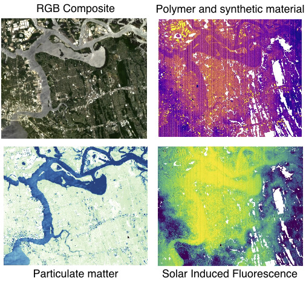

# Urban Hyperspectral Microclimate & Material Analysis

An advanced hyperspectral analysis pipeline leveraging spaceborne imagery (Tanager-1 data) over Jacksonville, Florida. This repository provides end-to-end workflows to decouple atmospheric interference, map thermodynamic radiative forcing, profile synthetic urban polymers, and monitor solar-induced fluorescence (SIF).



---

## Overview

Urban environments present complex microclimates where structural geometry, atmospheric water vapor, and synthetic surface materials heavily alter thermal dynamics. This project processes high-resolution Short-Wave Infrared (SWIR) and optical hyperspectral datacubes to extract physical and chemical surface properties.

Key capabilities include:

- **Atmospheric & Plume Disambiguation:** Differentiating atmospheric moisture gradients and material false positives (e.g., highly reflective TPO warehouse roofs) from localized gas emission plumes.
- **Thermodynamic & Thermal Storage Mapping:** Calculating Radiative Forcing Potential (RFP) to isolate non-vegetated infrastructure acting as long-wave thermal batteries.
- **Architectural Energy Trapping:** Modeling photon trapping within urban street canyons via the Anisotropic Cavity Trap Index (ACTI).
- **Synthetic & Smart Material Identification:** Isolating C-H hydrocarbon overtones ($1730\text{ nm}$) for polymers/roof coatings and UV bandgap edges ($390\text{ nm}$) for photocatalytic $\text{TiO}_2$ surfaces.
- **Biological Vitality Tracking:** Quantifying real-time kinetic carbon capture and canopy transpiration using Solar-Induced Fluorescence (SIF) infill at the Oxygen-A core ($760.4\text{ nm}$).
- **Physics-Space Ecotone Segmentation:** Fusing physical photon trapping, biological glow, and smart surface chemistry into a unified multi-dimensional RGB composite.

---

## Repository Structure

```text
├── assets/
│   └── diagram.jpg           # Project teaser / multi-panel dashboard image
├── notebooks/                # Execution notebooks for spectral indexing & mapping
├── requirements.txt          # Python dependencies for environment setup
└── README.md                 # Project documentation
```
